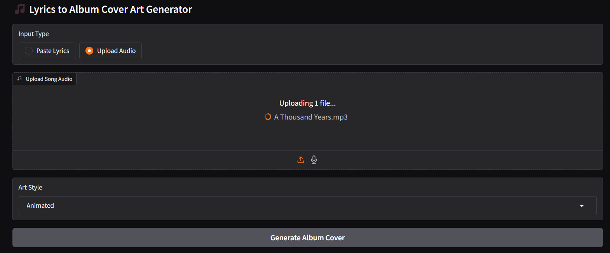

# 🎵 CoverTune: AI-Powered Album Cover Generator from Audio




**CoverTune** is a multimodal AI pipeline that transforms short music clips into stylized album cover art. By combining speech recognition, language detection, translation, prompt engineering, and image synthesis, it offers a seamless, end-to-end system for artists and musicians to visualize their sound — no design skills needed.

---

## 🚀 Features

- 🎙️ **Audio Transcription** using OpenAI's Whisper
- 🌍 **Language Detection** with XLM-RoBERTa
- 🔤 **Multilingual Translation** via OPUS-MT (Helsinki-NLP)
- ✨ **Prompt Generation** using FLAN-T5
- 🎨 **Image Generation** with Stable Diffusion
- 🖱️ **User Interface** built using Gradio (drag & drop UI)

---

## 📌 Project Workflow

1. **Upload Audio Clip** (10–30 seconds)
2. System transcribes lyrics (via Whisper)
3. Detects and translates non-English lyrics
4. Summarizes lyrics into visual prompt (FLAN-T5)
5. Generates album cover in selected style (anime, oil painting, etc.)
6. Download final image

---

## 🧠 Models Used

| Component              | Model                                      |
|------------------------|---------------------------------------------|
| Speech-to-Text         | [Whisper](https://cdn.openai.com/papers/whisper.pdf)                  |
| Language Detection     | [XLM-RoBERTa](https://arxiv.org/abs/1911.02116)              |
| Translation            | [OPUS-MT](https://huggingface.co/Helsinki-NLP)               |
| Prompt Generation      | [FLAN-T5](https://arxiv.org/abs/2210.11416)                 |
| Image Synthesis        | [Stable Diffusion](https://arxiv.org/abs/2112.10752)         |
| Interface              | Gradio                                    |

---

## 🛠️ Installation

> ⚠️ Requires Python 3.8+, CUDA GPU recommended for image generation.

```bash
# Clone the repo
git clone https://github.com/snehapadgaonkar/CoverTune-AI.git

#💻 Run the App
python app.py
```
---

▶️ Or Run in Google Colab\
Use the pre-configured Colab Notebook for easier GPU-accelerated testing in-browser using aipro.ipynb file
